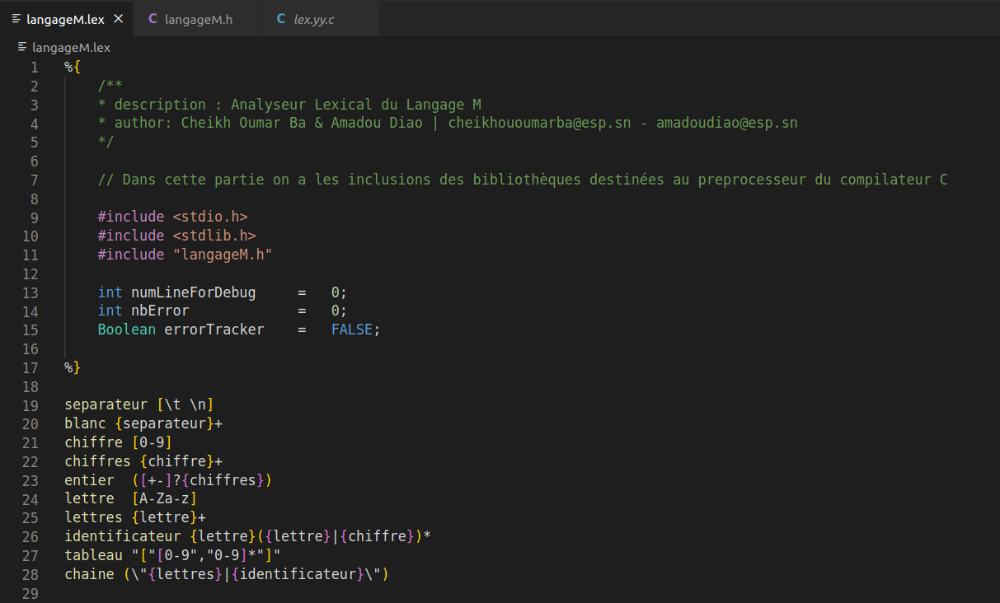

# Creation-d-un-analyseur-lexical-avec-lex

L’objectif de ce mini projet est de programmer un analyseur lexical pour le
langage M. L’analyseur lexical se présente comme une fonction, int yylex() qui, à
chaque appel, renvoie comme résultat le code de l’unité lexicale dont c’est le
tour. De plus, cette fonction met dans la variable yytext la valeur de l’unité
lexicale reconnue. Ainsi, lorsque yylex reconnaı̂t la chaı̂ne de caractères 123, elle
renverra le type NOMBRE et mettra dans la variable yytext la chaı̂ne de
caractère’ 123’.

## Screenshots
## Regles et Declaration
&nbsp;&nbsp;&nbsp;&nbsp;&nbsp;&nbsp;&nbsp;&nbsp;&nbsp;&nbsp;
## Resultats
&nbsp;&nbsp;&nbsp;&nbsp;&nbsp;&nbsp;&nbsp;&nbsp;&nbsp;&nbsp;
